<div align="center">

# TravelMemory Deployment using Terraform and Ansible

### Automated AWS infrastructure provisioning and MERN application deployment using Terraform and Ansible


</div>
---

## Table of Contents

- [Project Overview](#project-overview)
- [Project Evolution](#project-evolution)
- [Key Features](#key-features)
- [Solution Architecture](#solution-architecture)
- [Technology Stack](#technology-stack)
- [Repository Structure](#repository-structure)
- [Prerequisites](#prerequisites)
- [Deployment Workflow](#deployment-workflow)
- [Validation](#validation)
- [Cleanup Infrastructure](#cleanup-infrastructure)
- [Project Screenshots](#project-screenshots)
- [Future Improvements](#future-improvements)
- [Author](#author)
- [License](#license)

---

## Project Overview

This project automates the deployment of the TravelMemory MERN application on AWS using Infrastructure as Code (Terraform) and Configuration Management (Ansible).

Terraform provisions the AWS infrastructure, while Ansible configures the application stack by installing dependencies, deploying the backend and frontend, configuring MongoDB, managing the application with PM2, and serving the React application through NGINX.

The project demonstrates a modular, reusable, and automated approach to deploying a multi-tier MERN application on AWS.

---

## Project Evolution

This project builds upon a previously completed manual deployment of the TravelMemory MERN application on AWS.

The application stack (React, Express.js, MongoDB, PM2, and NGINX) remains the same, while the deployment process has been transformed from a manual, command-driven workflow into an automated Infrastructure as Code solution using Terraform and Ansible.

The result is a repeatable, modular, and automated deployment process that provisions infrastructure, configures servers, deploys the application, validates the deployment, and supports clean infrastructure teardown using `terraform destroy`.

### Evolution of the Deployment Architecture

| Manual Deployment | Automated Deployment |
|-------------------|----------------------|
| [View Manual Architecture](docs/architecture/01-manual-deployment-architecture.png) | [View Terraform + Ansible Architecture](docs/architecture/02-terraform-ansible-architecture.png) |

---

## Key Features

- Modular Terraform infrastructure using reusable modules.
- Automated server provisioning with Ansible roles.
- Multi-tier MERN application deployment.
- Private database server accessed through a bastion host.
- Automated backend deployment with PM2.
- Automated frontend build and deployment with NGINX.
- Infrastructure validation using Terraform outputs and Ansible verification tasks.

---

## Solution Architecture

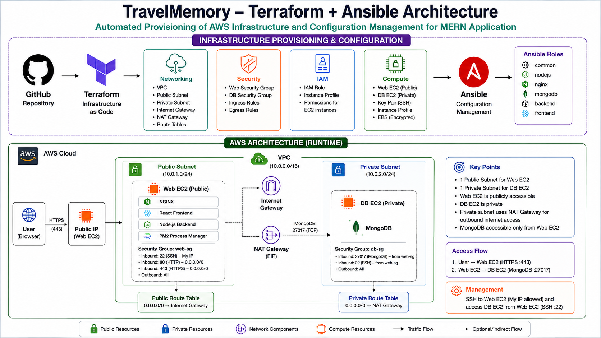

---

### Architecture Highlights

The following architecture illustrates how Terraform provisions the AWS infrastructure and how Ansible automates the configuration and deployment of the TravelMemory MERN application.

- Modular Terraform infrastructure
- Public Web Server and Private MongoDB Server
- Bastion Host access using SSH Agent Forwarding
- Automated configuration using Ansible Roles
- React frontend served through NGINX
- Backend managed using PM2

---

## Technology Stack

| Category | Technologies |
|----------|--------------|
| Cloud | AWS |
| Infrastructure as Code | Terraform |
| Configuration Management | Ansible |
| Operating System | Ubuntu |
| Frontend | React |
| Backend | Node.js, Express.js |
| Database | MongoDB |
| Web Server | NGINX |
| Process Manager | PM2 |
| Version Control | Git & GitHub |

---

## Repository Structure

```text
.
├── ansible/                     # Ansible playbooks, inventory, and reusable roles
├── backend/                     # Express.js backend application
├── docs/
│   ├── architecture/            # Architecture diagrams
│   └── screenshots/
│       ├── automated-deployment/# Terraform, Ansible, AWS, and application screenshots
│       └── manual-deployment/   # Manual deployment reference screenshots
├── frontend/                    # React frontend application
├── nginx-config/                # NGINX configuration files
├── terraform/                   # Terraform modules and infrastructure code
├── LICENSE
└── README.md
```
---

## Prerequisites

Before deploying the project, ensure the following tools are installed:

- AWS CLI
- Terraform
- Ansible
- Git
- SSH Client
- Node.js and npm (for local frontend development)

---

## Deployment Workflow

1. Clone the repository.
2. Configure AWS credentials.
3. Update `terraform.tfvars` with your environment values.
4. Provision AWS infrastructure using Terraform.
5. Generate the Ansible inventory from the Terraform outputs.
6. Execute the Ansible playbooks to configure the web and database servers.
7. Deploy the backend and frontend applications.
8. Validate the application through the web server's public IP address.

---

## Validation

The deployment was validated by verifying:

- Terraform successfully provisioned the AWS infrastructure.
- Ansible configured both web and database servers.
- MongoDB service was running.
- Backend application was managed using PM2.
- React application was built and served by NGINX.
- Backend APIs responded successfully.
- Frontend application was accessible through the web server.

### Deployment Verification

| Complete Automated Deployment |
|-------------------------------|
| 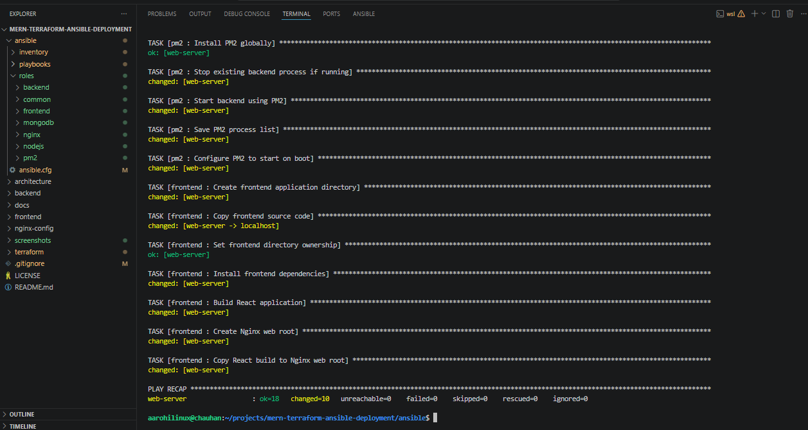 |

---

## Cleanup Infrastructure

After validating the deployment, the provisioned AWS infrastructure can be safely removed using Terraform.

```bash
cd terraform
terraform destroy
```
This project demonstrates the complete Infrastructure as Code lifecycle by provisioning, validating, and cleanly destroying all AWS resources to prevent unnecessary cloud costs.

| Destroy Plan | Destroy Complete |
|--------------|------------------|
| 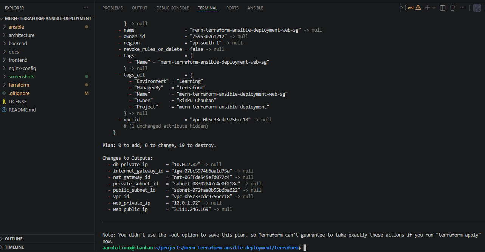 | 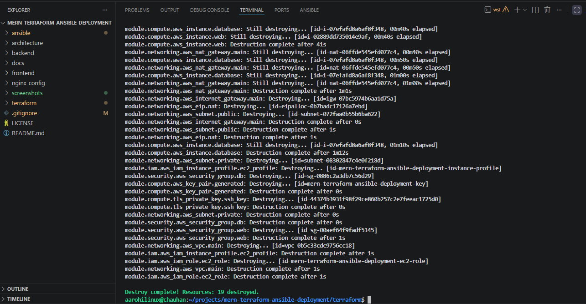 |

---

## Project Screenshots

### AWS Infrastructure

| VPC | Web Server | Database Server |
|-----|------------|-----------------|
| 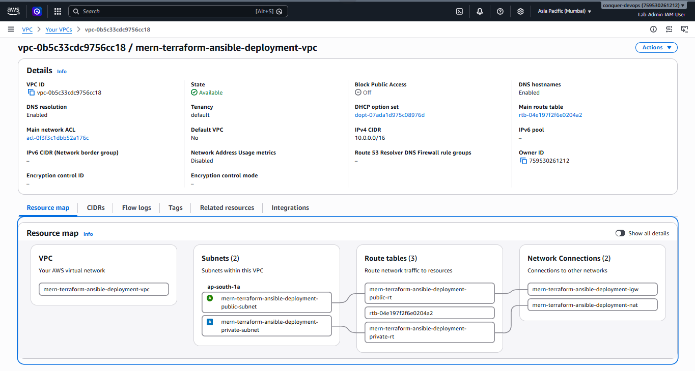 | 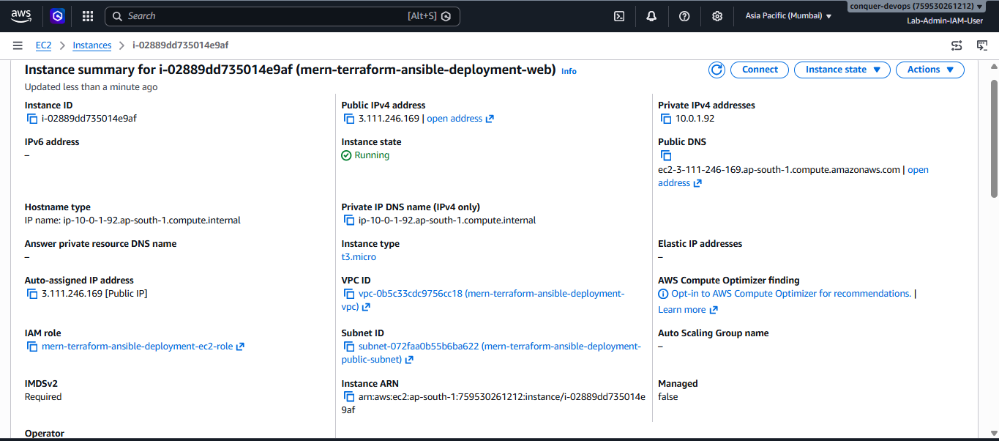 | 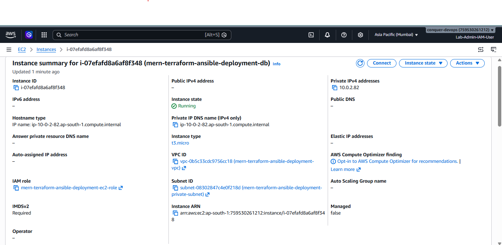 |

---

### Terraform

| Provisioning | Outputs |
|--------------|---------|
| 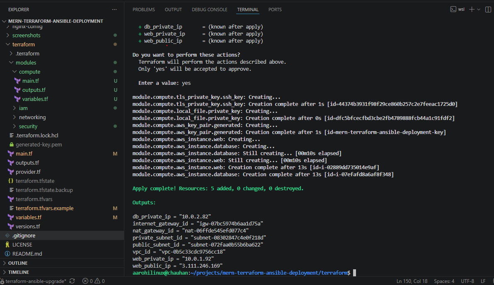 | 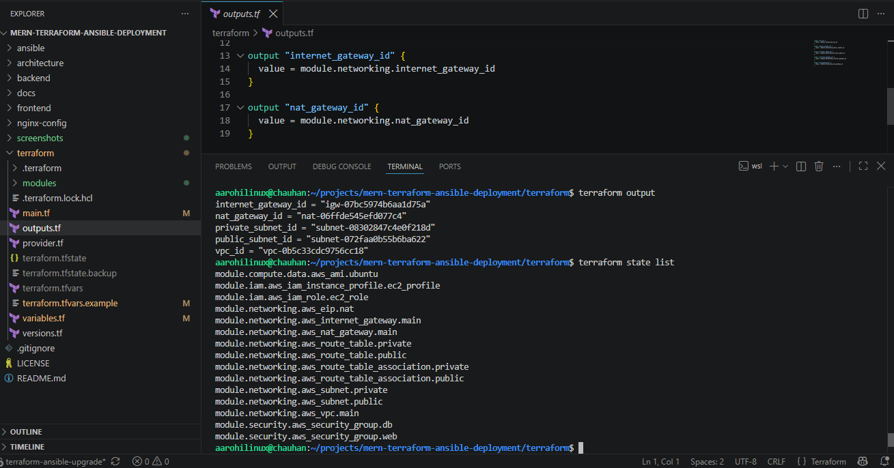 |

---

### Ansible

| Playbook Execution | Deployment Complete |
|--------------------|---------------------|
| 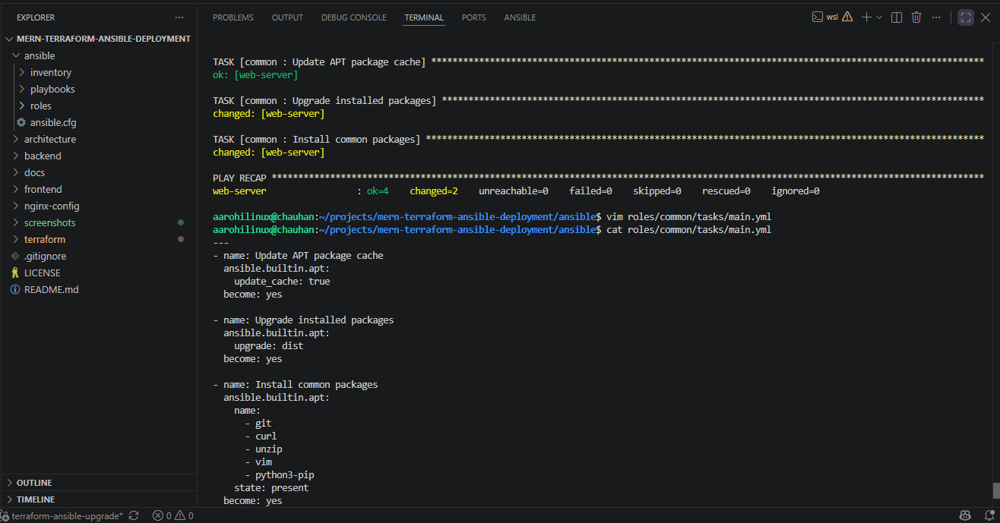 |  |

---

### Application

| TravelMemory Application |
|--------------------------|
| 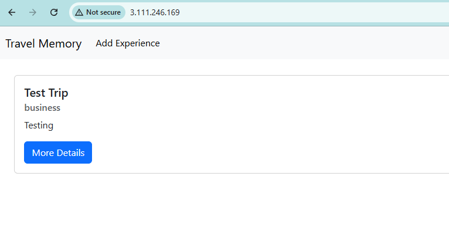 |

---

## Future Improvements

- Provision an Application Load Balancer (ALB) using Terraform.
- Automate DNS management using Amazon Route 53.
- Configure HTTPS using AWS Certificate Manager (ACM).
- Store Terraform state remotely using Amazon S3 and DynamoDB.
- Integrate a CI/CD pipeline using GitHub Actions or Jenkins.
- Deploy the application using Docker and Kubernetes.

---

## Author

**Rinku Chauhan**

Senior System Engineer | Aspiring Cloud & DevOps Engineer

- GitHub: https://github.com/rinku-chauhan
- LinkedIn: https://linkedin.com/in/rinku-chauhan

---

## License

This project is licensed under the MIT License.
